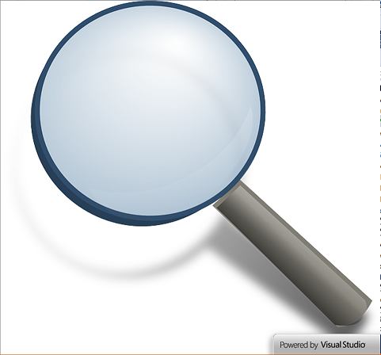
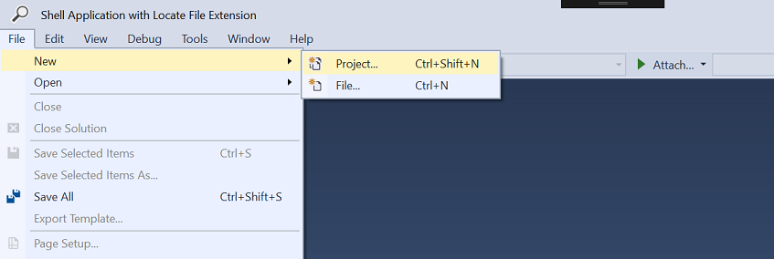
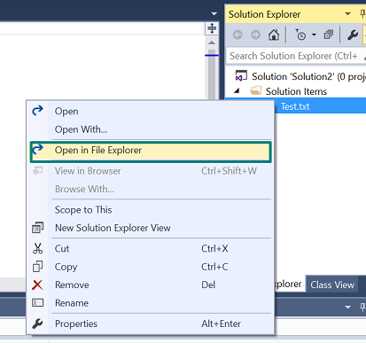

# Shell VSIX manifest

<!-- Replace this badge with your own-->

<!-- Update the VS Gallery link after you upload the VSIX-->
Download this extension from the [VS Gallery](https://visualstudiogallery.msdn.microsoft.com/[GuidFromGallery])
or get the [CI build](http://vsixgallery.com/extension/2ee35495-d7e7-4b2d-ac95-31f21159f425/).

---------------------------------------

Core extensions for ShellApplication

See the [change log](CHANGELOG.md) for changes and road map.

## Features

- Isolated Shell Application Containing File locator extension.

### Feature 1
Launch Visual Studio isolated Shell Application with a custom splash screen.

### Feature 2
Add or open a new/existing project

### Feature 3
Directly open the files in the added project to the file system.

## Contribute
Check out the [contribution guidelines](CONTRIBUTING.md)
if you want to contribute to this project.

For cloning and building this project yourself, make sure
to install the
[Extensibility Tools 2015](https://visualstudiogallery.msdn.microsoft.com/ab39a092-1343-46e2-b0f1-6a3f91155aa6)
extension for Visual Studio which enables some features
used by this project.

## License
[Apache 2.0](LICENSE)